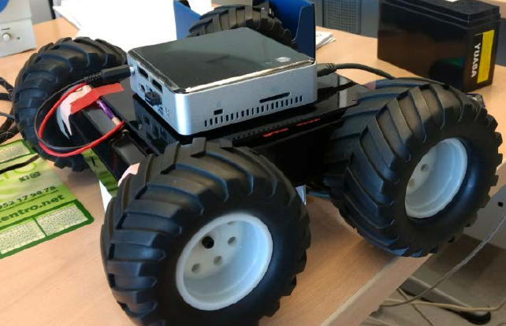
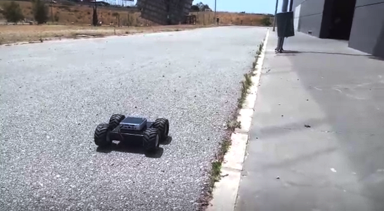

# UMA Open Source Rover
Open hardware and software rover developed by the University of Malaga

*Authors:* C.J. Pérez del Pulgar, Ricardo Sánchez Ibáñez, Patricio López Lupiañez and Francisco de Asís Delgado Rivero

*Contact info:* carlosperez@uma.es

*Affiliation:* University of Malaga, [Space Robotics Lab](https://www.uma.es/robotics-and-mechatronics/info/107542/robotica-espacial/)

## Overview
The OpenUmaRov is an open source mobile robotic platform that allows anyone to build it with a maximum cost of 500€. The platform is based on commercial components that can be adcquired by Internet. This project involves students and researchers to improve the development of the platform. Moreover, it can be used for teaching and research activities that involves mechanical, engineering, software, electronics and robotics.

Required software:
Eagle: Software to design PCB.
Arduino IDE: The open platform is based on an Arduino
Matlab 2016b: The platform includes a computer (NUC) that executes a Matlab Simulink diagram to perform motions.

## Rover prototype

The current version of the rover is shown in the following images. An experiment was carried out to demonstrate the rover is able to move indoor and outdoor.

The following video shows the rover performing a square.

## Assembly

### Ordering Parts

The rover system is made up of mechanical, electronic and computer parts. All of these parts can be obtained from the [Part list](https://github.com/spaceuma/OPEN-UMA-Rover/blob/master/Materials/Material.xlsx). The rover is based on a chassis provided by [RobotShop](https://www.robotshop.com/eu/en/4wd1-robot-aluminum-kit.html), an [Arduino Mega 2560](https://store.arduino.cc/arduino-mega-2560-rev3) with a [Sparkfun GPS Logger Shield](https://www.sparkfun.com/products/13750) (Optional) and a customized [PCB](https://github.com/spaceuma/OPEN-UMA-Rover/tree/master/Electrical) that includes [H-Bridges](http://www.ti.com/product/LMD18200) and [current sensors](https://www.allegromicro.com/en/Products/Sense/Current-Sensor-ICs/Zero-To-Fifty-Amp-Integrated-Conductor-Sensor-ICs/ACS712).

### Mechanical parts

The rover chassis can include two or four motors. The current version includes two [motors](https://www.robotshop.com/eu/en/lynxmotion-12vdc-200rpm-078kg-cm-ghm-16-w--rear-shaft.html) with [encoder](https://www.robotshop.com/eu/en/lynxmotion-quadrature-motor-encoder-v2-cable.html) (front) and two motors without encoders (back). The encoder should be fixed to the motor following the encoder instructions.
 
 

### Electrical and electronics

The rover power supply PCB has been designed using the CAD software Eagle and it has been manufactured by [Eurocircuits](https://www.eurocircuits.com). The CAD design can be found in the ["Electrical"](https://github.com/spaceuma/OPEN-UMA-Rover/tree/master/Electrical) folder and the electronic components are found in the [Part list](https://github.com/spaceuma/OPEN-UMA-Rover/blob/master/Materials/Material.xlsx). The resulting PCB is shown in the following figure.

 

### Arduino platform

### GPS

### Computer software

