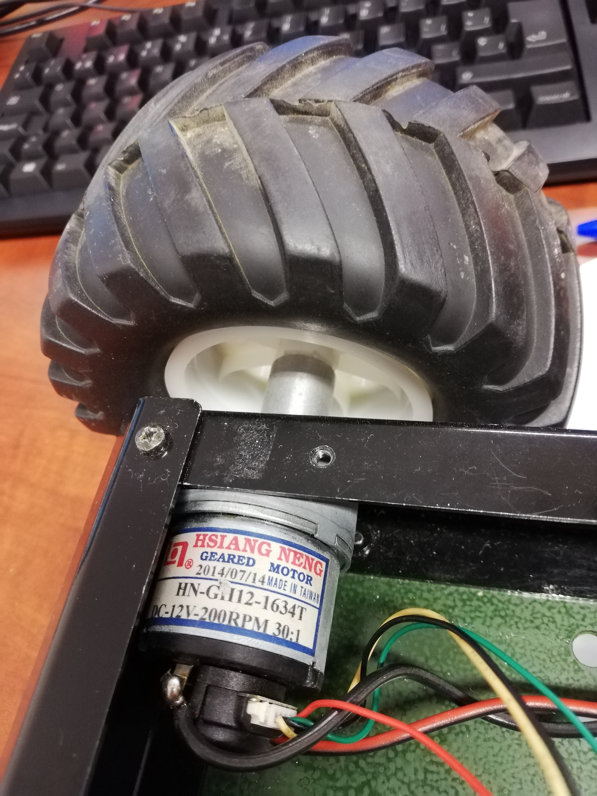
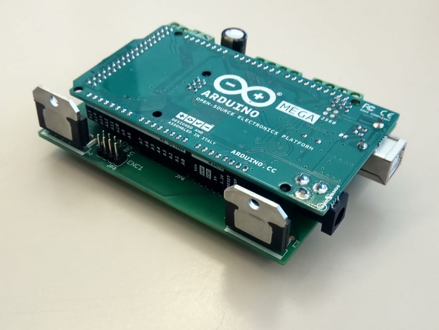
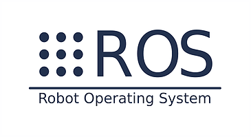
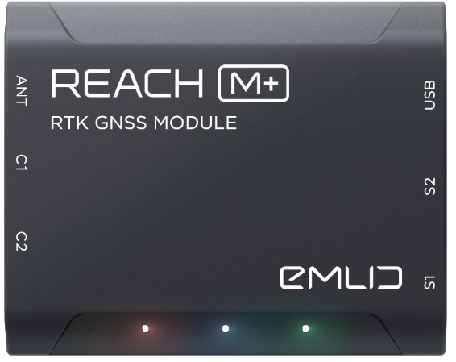
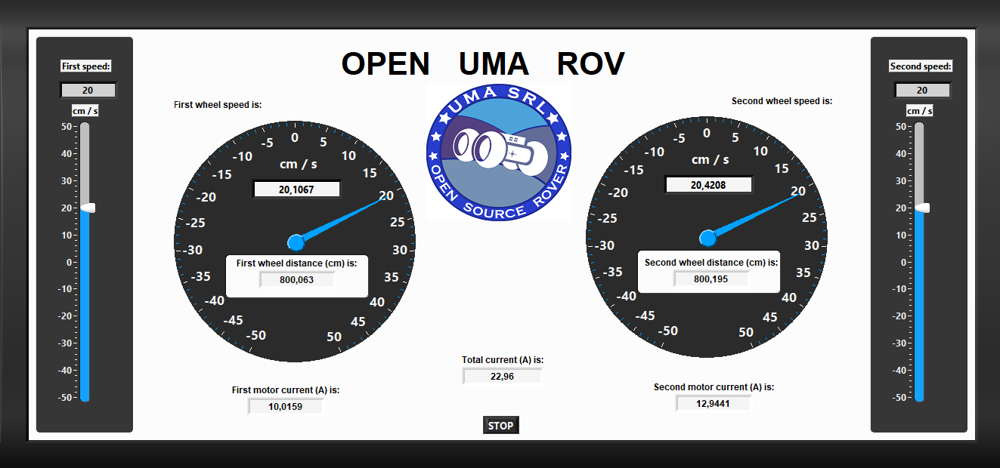
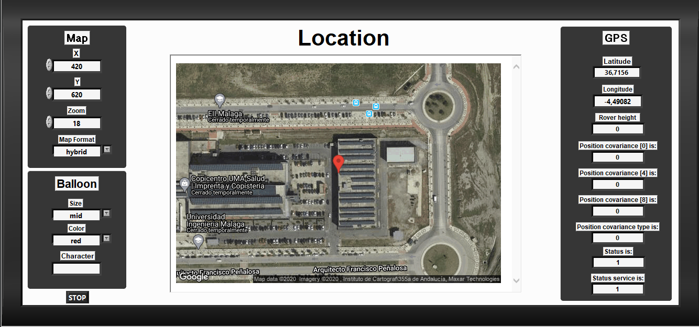

# UMA Open Source Rover
Open hardware and software rover developed by Malaga University

*Authors:* C.J. Pérez del Pulgar, Ricardo Sánchez Ibáñez, Patricio López Lupiañez, Francisco de Asís Delgado Rivero and Laura Marta Mantoani

*Contact info:* carlosperez@uma.es

*Affiliation:* University of Malaga, [Space Robotics Lab](https://www.uma.es/robotics-and-mechatronics/info/107542/robotica-espacial/)

## Overview
The OpenUmaRov is an open source mobile robotic platform that allows anyone to build it with a maximum cost of 700€, taking into account that the GPS Reach M+ can be replaced with a cheaper one, giving the possibility to build it with a maximum cost of 500 €. The platform is based on commercial components that can be adcquired by Internet. This project involves students and researchers to improve the development of the platform. Moreover, it can be used for teaching and research activities that involves mechanical, engineering, software, electronics and robotics.

Required software:

- Eagle: Software to design PCB.

- Arduino IDE: the open platform is based on an Arduino.

- LabVIEW: the platform has a LabVIEW GUI.

- ROS: the platform is controlled using ROS framework. 

- Python IDE: the OpenUMARov node and the GPS node are written in Python.

## Assembly

### Ordering Parts

The rover system is made up of mechanical, electronic and computer parts. All of these parts can be obtained from the [Part list](https://github.com/spaceuma/OPEN-UMA-Rover/blob/master/Materials/Material.xlsx). The rover is based on a chassis provided by [RobotShop](https://www.robotshop.com/eu/en/4wd1-robot-aluminum-kit.html), an [Arduino Mega 2560](https://store.arduino.cc/arduino-mega-2560-rev3) with a [Emlid GPS Reach M+](https://emlid.com/reach/) (Optional), a [Raspberry Pi 3B+](https://www.raspberrypi.org/products/raspberry-pi-3-model-b-plus/) and a customized [PCB](https://github.com/spaceuma/OPEN-UMA-Rover/tree/master/Electrical) that includes [H-Bridges](http://www.ti.com/product/LMD18200) and [current sensors](https://www.allegromicro.com/en/Products/Sense/Current-Sensor-ICs/Zero-To-Fifty-Amp-Integrated-Conductor-Sensor-ICs/ACS712).

### Mechanical parts

The rover chassis can include two or four motors. The current version includes two [motors](https://www.robotshop.com/eu/en/lynxmotion-12vdc-200rpm-078kg-cm-ghm-16-w--rear-shaft.html) with [encoder](https://www.robotshop.com/eu/en/lynxmotion-quadrature-motor-encoder-v2-cable.html) (front) and two motors without encoders (back). The encoder should be fixed to the motor following the encoder instructions.

 
 

### Electrical and electronics

The rover power supply PCB has been designed using the CAD software Eagle and it has been manufactured by [Eurocircuits](https://www.eurocircuits.com). The CAD design can be found in the ["Electrical"](https://github.com/spaceuma/OPEN-UMA-Rover/tree/master/Electrical) folder and the electronic components are found in the [Part list](https://github.com/spaceuma/OPEN-UMA-Rover/blob/master/Materials/Material.xlsx). The resulting PCB is shown in the following figure.

 

### Arduino platform

### Raspberry Pi

The Raspberry Pi 3B+ is used to control the rover. Using the ROS framework, it receives data from Arduino through the serial port, and from the GPS ROS node subscribing to its topics, publishing each value in a different topic that can be visualized in a LabVIEW GUI.

### ROS

The rover uses the ROS framework. There are two different nodes: one for the GPS (nmea_navsat_driver) and one for all data received from Arduino (open_uma_rov_node). Moreover, LabVIEW is working with the ROSforLabVIEW software, that allows to publish and subscribe to different topics. 

### GPS

The rover uses a GPS Reach M+, a high precision GPS with a centimetre accuracy. Anyway, it can be replaced with a cheaper one, lowering the rover total cost. 

### LabVIEW 

The LabVIEW GUI allows to control the rover. It has two topics where you can publish wheels speeds, and different topics where you can visualize all the data from Arduino and from the GPS. Moreover, GPS position can be visualized in a Google Maps map.  

